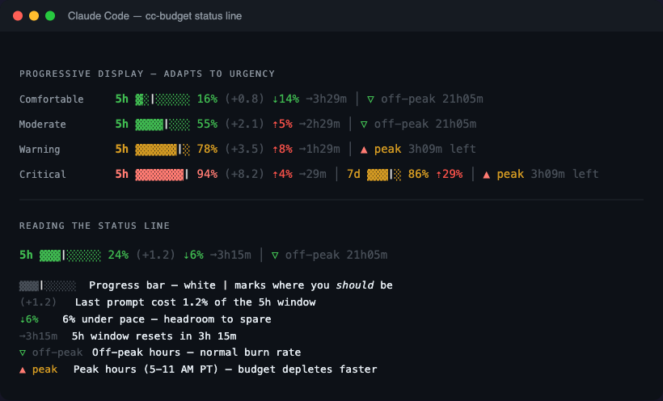

# cc-budget

Know your Claude Code budget before you hit the wall.



cc-budget adds budget intelligence to Claude Code's status line — pacing targets, per-prompt cost tracking, peak/off-peak awareness, and threshold warnings. It answers the question every Max/Pro user has: **"How many prompts can I afford right now?"**

## Features

**Pacing** — A white `│` marker in the progress bar shows where your usage *should* be for even distribution across the window. The `⇡`/`⇣` indicator tells you instantly if you're burning too fast or have headroom.

```
▓▓▓│░░░░░ 24%  ⇣6%     Under pace — 6% headroom. Relax.
▓▓▓▓▓▓│░░ 78%  ⇡12%    Over pace — burning 12% faster than sustainable.
▓▓▓▓│░░░░ 50%  on pace  Right where you should be.
```

**Per-prompt delta** — See what each prompt actually costs as a percentage of your 5h window. A simple question might be `(+0.3)`, a multi-agent plan execution could be `(+12.5)`.

**Peak/off-peak** — Anthropic charges more during peak hours (5-11 AM PT, weekdays). cc-budget detects this across all timezones and shows a countdown: `▲ peak 3h22m left` or `▽ off-peak 21h05m`.

**Threshold warnings** — At 90% and 95% usage, a terse warning is injected before your prompt (once per crossing, under 20 tokens). No spam, no blocking — just awareness when it matters.

**Progressive display** — Low usage shows minimal info. As usage climbs, reset timers, 7-day window, and peak indicators appear. The status line adapts to urgency.

```
Comfortable:  5h ▓░│░░░░░ 16% ⇣14% ➞3h29m │ ▽ off-peak 21h05m
Warning:      5h ▓▓▓▓▓▓│░ 78% ⇡8%  ➞1h29m │ ▲ peak 3h09m left
Critical:     5h ▓▓▓▓▓▓▓│ 94% ⇡4%  ➞29m   │ 7d ▓▓▓│░ 86% ⇡29% │ ▲ peak 3h09m left
```

## Install

```bash
git clone https://github.com/user/cc-budget /tmp/cc-budget
cd /tmp/cc-budget && ./install.sh
```

Or manually:

```bash
mkdir -p ~/.claude/hooks/cc-budget/lib
cp statusline.cjs hook.cjs ~/.claude/hooks/cc-budget/
cp lib/*.cjs ~/.claude/hooks/cc-budget/lib/

mkdir -p ~/.config/cc-budget
cp config.example.json ~/.config/cc-budget/config.json
```

Then add to `~/.claude/settings.json`:

```json
{
  "statusLine": {
    "type": "command",
    "command": "node ~/.claude/hooks/cc-budget/statusline.cjs"
  },
  "hooks": {
    "UserPromptSubmit": [
      {
        "matcher": "",
        "hooks": [{
          "type": "command",
          "command": "node ~/.claude/hooks/cc-budget/hook.cjs",
          "timeout": 5000
        }]
      }
    ]
  }
}
```

## Requirements

- Claude Code v2.1.80+ (provides `rate_limits` in status line JSON)
- Claude Max or Pro plan (API/PAYG users see session cost instead)
- Node.js (ships with Claude Code — zero external dependencies)

## Configuration

Edit `~/.config/cc-budget/config.json`:

```jsonc
{
  "thresholds": {
    "warn_5h": 90,          // fire warning at this 5h usage %
    "critical_5h": 95,      // fire critical warning
    "warn_7d": 80,
    "critical_7d": 90
  },
  "peak": {
    "start_hour": 5,        // Anthropic peak start (Pacific Time)
    "end_hour": 11,         // Anthropic peak end (Pacific Time)
    "timezone": "America/Los_Angeles",
    "weekdays_only": true
  },
  "show_delta": true,       // show (+N.N) per-prompt cost
  "show_7d": "auto"         // "auto" | "always" | "never"
}
```

Defaults are built in — the config file is optional.

## Visual legend

Run this to see a full annotated guide to the status line:

```bash
node ~/.claude/hooks/cc-budget/statusline.cjs --legend
```

## ccstatusline integration

Already using [ccstatusline](https://github.com/sirmalloc/ccstatusline)? Add cc-budget as a Custom Command widget — no need to replace your statusline:

```yaml
widgets:
  - type: customCommand
    command: "node ~/.claude/hooks/cc-budget/statusline.cjs --widget"
    timeout: 1000
```

Widget mode outputs only what ccstatusline doesn't have: pacing, per-prompt delta, and peak indicator. The hook warnings work regardless of which statusline you use.

## How it works

1. Claude Code pipes `rate_limits` JSON to the status line command on every assistant message
2. cc-budget writes state atomically to `~/.claude/cc-budget/state.json` (SIGTERM-safe)
3. Computes delta from previous reading, pacing target, and peak/off-peak status
4. Outputs a progressive display that adapts to urgency
5. The hook reads state on each prompt, warns once per threshold crossing

Zero external dependencies. Zero API calls. All data comes from Claude Code's built-in status line JSON.

## Uninstall

```bash
rm -rf ~/.claude/hooks/cc-budget ~/.claude/cc-budget ~/.config/cc-budget
```

Then remove the `statusLine` and `UserPromptSubmit` entries from `~/.claude/settings.json`.

## License

MIT
